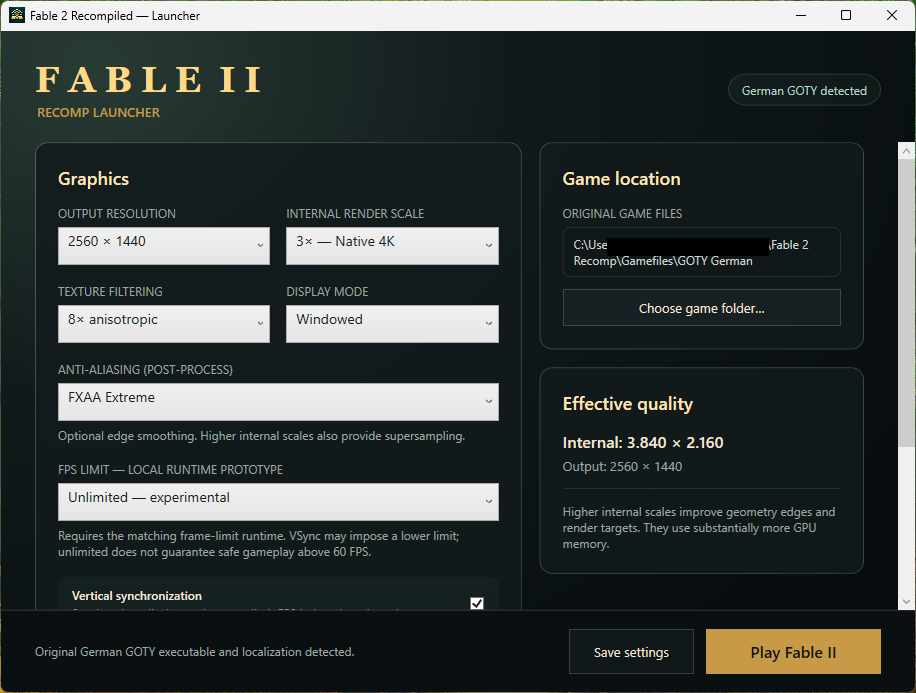

# Windows launcher

A .NET 8 WPF settings launcher for verified GOTY USA/Europe and German GOTY
dumps. It validates the original XEX and content markers, then checks the
native build descriptor. Unknown revisions and known mixed retail/TU1 content
are rejected; no original game files are copied or modified.

Settings: 720p/1080p/1440p/4K output, 1x–4x internal render scale, anisotropic
filtering (game default through 16x), none/FXAA/FXAA Extreme, VSync,
windowed/borderless/exclusive fullscreen and 30/60/120/144/165/240/unlimited FPS. Output size
is separate from the original 720p guest mode. The FPS options need the
matched source-built Release runtime described in
[the runtime guide](../docs/RUNTIME_FIXES.md). Higher rates are not a promise
of correct timing in every scene.

Dropdowns use dark text on a light background, including the selected item.
There are no texture/font replacements, remaster switches or save editors.
The launcher and game use an original project-owned book/tree icon, not
extracted game art; see [asset provenance](../assets/README.md).

Build from the repository root:

```cmd
build.cmd launcher
build.cmd launcher-self-contained
dotnet run --project tests/Fable2.Launcher.ConfigTests -c Release
```

The first build needs the .NET 8 SDK; the second bundles the desktop runtime.
Output is `out/tests/launcher-build/Fable2Launcher.exe`. Put it beside
`fable_2.exe`, its matched DLLs, `fable2_build.json` and `app-icon.png`.

A fresh launcher starts with no selected game folder. After choosing one,
`launcher-game-path.txt` beside the launcher remembers that user's location.
No developer path, global fallback or automatic dump selection is embedded.
The directory must be writable to persist settings.

`launcher-settings.toml` stores only the managed preferences. The launcher
reads existing `fable_2.toml` first for legacy configurations, then overlays
those preferences so runtime rewrites cannot reset output resolution or render
scale. Save/start writes both files. Unknown engine settings are preserved,
and the first engine-config write creates a one-time backup. Saves, caches and
logs remain beside the native EXE, not in the original dump.

F3 in the game shows the guest-swap FPS counter in Release.
`StartWithoutAudio.cmd`, staged with the native EXE, exercises the clocked
silent fallback without disabling any Windows device. Exit existing game and
launcher processes before running that test.


Launcher overview supplied by the tester (before the high-refresh presets were added):


